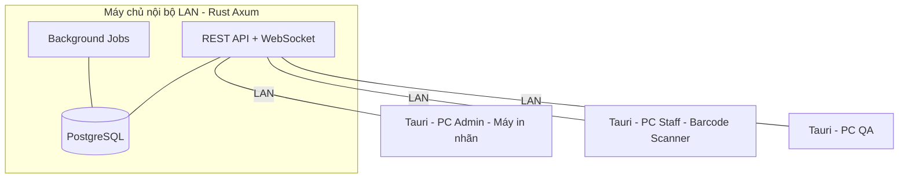
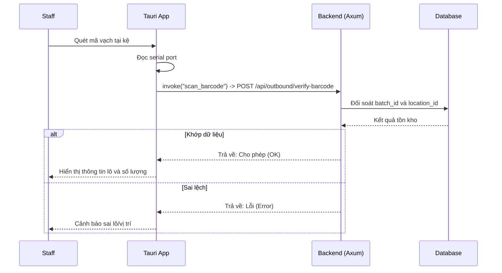
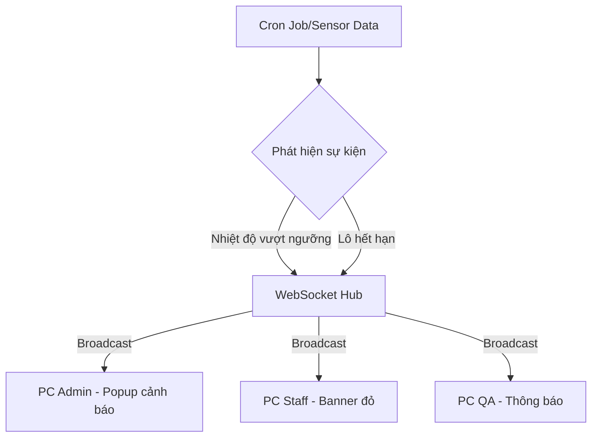
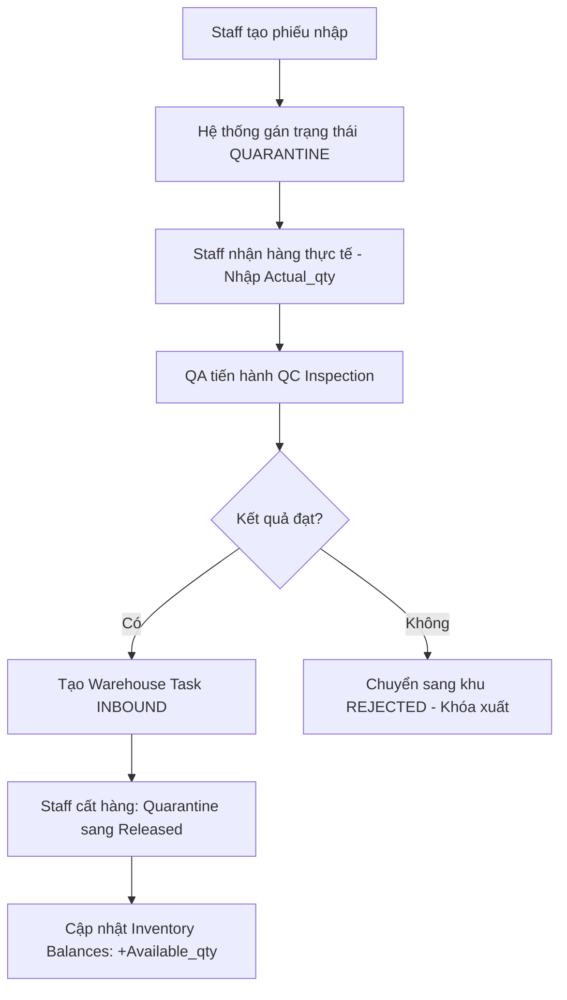
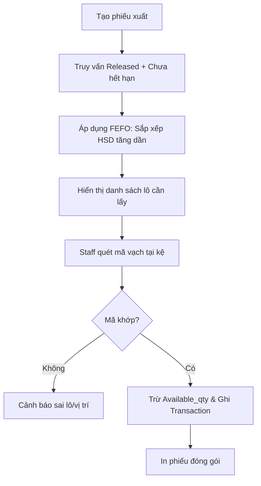
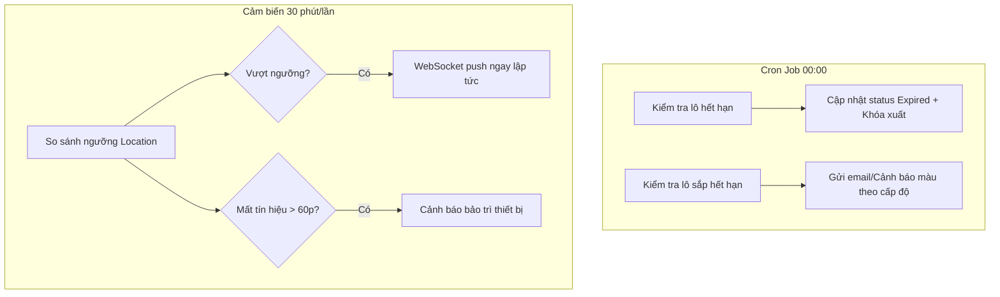
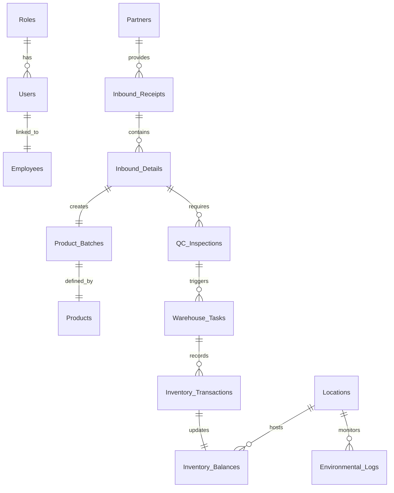

# Hệ thống Quản lý Kho Dược phẩm (WMS - GSP/GDP)

> **Phiên bản:** 1.0  
> **Tiêu chuẩn:** GSP (Good Storage Practices) · GDP (Good Distribution Practices)  
> **Stack:** Rust (Axum) · PostgreSQL · Tauri · Vue 3 · Nuxt UI · TypeScript

---

## Mục lục

1. [Tổng quan hệ thống](#1-tổng-quan-hệ-thống)
2. [Kiến trúc kỹ thuật](#2-kiến-trúc-kỹ-thuật)
3. [Cấu trúc Repo](#3-cấu-trúc-repo)
4. [Các tác nhân (Actors)](#4-các-tác-nhân-actors)
5. [Ma trận phân quyền](#5-ma-trận-phân-quyền)
6. [Danh mục Use Case](#6-danh-mục-use-case)
7. [Quy trình nghiệp vụ chính](#7-quy-trình-nghiệp-vụ-chính)
8. [Cấu trúc cơ sở dữ liệu](#8-cấu-trúc-cơ-sở-dữ-liệu)
9. [Ràng buộc & Quy tắc nghiệp vụ](#9-ràng-buộc--quy-tắc-nghiệp-vụ)
10. [Đặc tả Use Case chi tiết](#10-đặc-tả-use-case-chi-tiết)

---

## 1. Tổng quan hệ thống

Hệ thống WMS Dược phẩm được thiết kế để quản lý chuỗi cung ứng dược phẩm, đảm bảo tuân thủ nghiêm ngặt tiêu chuẩn **GSP** và **GDP**. Trọng tâm của hệ thống là:

- **Truy xuất nguồn gốc** — Biết mọi lô hàng đến từ đâu, đi đến đâu
- **Kiểm soát điều kiện bảo quản** — Nhiệt độ, độ ẩm theo thời gian thực
- **Luân chuyển theo FEFO** — First Expired First Out, giảm tối đa hủy hàng
- **Kiểm soát chất lượng** — Mọi lô phải qua QA trước khi được phép xuất

### 1.1 Các khu vực kho

| Khu vực | Mô tả | Nhiệt độ |
|---|---|---|
| **Quarantine** | Biệt trữ — hàng mới nhập, chờ QA kiểm tra | Theo sản phẩm |
| **Released** | Đã kiểm, sẵn sàng xuất bán | Theo sản phẩm |
| **Rejected** | Không đạt QC hoặc hết hạn — bị khóa xuất | Theo sản phẩm |
| **Recalled** | Hàng thu hồi từ thị trường | Theo sản phẩm |
| **Cold Room** | Kho lạnh chuyên biệt | Xem bảng dưới |
| **LASA** | Look-Alike Sound-Alike — hàng dễ nhầm lẫn | Theo sản phẩm |
| **Controlled** | Thuốc độc, hướng thần, gây nghiện | Kiểm soát đặc biệt |

#### Tiêu chuẩn nhiệt độ Cold Room

| Loại | Nhiệt độ |
|---|---|
| Kho lạnh | ≤ 8°C |
| Tủ lạnh | 2°C – 8°C |
| Kho đông lạnh | ≤ −10°C |
| Kho mát | 8°C – 15°C |

### 1.2 Nguyên tắc vận hành cốt lõi

- **FEFO** — Lô hết hạn trước xuất trước (FIFO chỉ áp dụng cho hàng không có HSD)
- **Nặng dưới nhẹ trên** — Hệ thống cảnh báo nếu xếp sai theo trọng lượng
- **Blind Counting** — Kiểm kê không hiện số tồn để đảm bảo tính khách quan
- **Audit Trail** — Mọi thay đổi số lượng, trạng thái đều được ghi log kèm người thực hiện

---

## 2. Kiến trúc kỹ thuật

### 2.1 Mô hình triển khai — Intranet



### 2.2 Lý do chọn Tauri thay Browser

| Tính năng | Browser | Tauri App |
|---|---|---|
| Đọc Barcode Scanner (USB/Serial) | ❌ Workaround phức tạp | ✅ Trực tiếp qua `serialport` |
| In nhãn thermal printer | ❌ Phụ thuộc driver web | ✅ Gọi lệnh in hệ thống |
| Thông báo desktop native | ❌ Cần permission | ✅ Tự nhiên |
| Auto-update nội bộ | ❌ | ✅ Self-hosted updater |
| Mất kết nối LAN | ❌ Trang trắng | ✅ Hiển thị màn hình lỗi có nút retry |

### 2.3 Tech Stack

#### Backend — Rust Server

| Layer | Thư viện | Vai trò |
|---|---|---|
| Web Framework | **Axum** | REST API + WebSocket |
| Database | **SQLx + PostgreSQL** | Query type-safe |
| Auth | **jsonwebtoken + bcrypt** | JWT phân quyền Role |
| Realtime | **WebSocket (Axum built-in)** | Push cảnh báo |
| Background Jobs | **tokio-cron-scheduler** | Cron tự động |
| Serialization | **serde + serde_json** | JSON request/response |
| File/PDF | **printpdf** | Xuất phiếu, biên bản |

#### Desktop — Tauri

| Layer | Thư viện | Vai trò |
|---|---|---|
| App Shell | **Tauri v2** | Bọc frontend thành native app |
| Hardware | **serialport-rs** | Đọc barcode scanner |
| Network Guard | **Tauri event + retry logic** | Phát hiện mất LAN, hiện màn hình lỗi |

#### Frontend — Vue 3 + Nuxt UI

| Layer | Thư viện | Vai trò |
|---|---|---|
| UI Framework | **Vue 3 + TypeScript** | Giao diện người dùng |
| App Framework | **Nuxt 3** | Routing, SSR/SPA, auto-import |
| UI Components | **Nuxt UI** | Component library (Tailwind-based) |
| HTTP Client | **useFetch / $fetch (Nuxt built-in)** | Gọi API |
| State | **Pinia** | Global state, tích hợp sẵn Nuxt |

### 2.4 Luồng Barcode Scanner



### 2.5 Luồng WebSocket — Cảnh báo Realtime



---

## 3. Cấu trúc Repo

Dùng **Monorepo** — một repo duy nhất chứa toàn bộ hệ thống.

```
wms-pharma/
│
├── backend/                    ← Rust Axum Server
├── desktop/                    ← Tauri App
├── frontend/                   ← Vue 3 + Nuxt UI (dùng chung cho Tauri)
├── shared/                     ← Types dùng chung
├── database/                   ← Migration & Seed
├── scripts/                    ← Deploy, setup scripts
├── docs/                       ← Tài liệu, ERD, đặc tả
│
├── Cargo.toml                  ← Rust workspace
├── package.json                ← npm workspace (frontend + shared)
└── docker-compose.yml          ← PostgreSQL cho local dev
```

### 3.1 `backend/`

```
backend/
├── src/
│   ├── main.rs
│   ├── config/mod.rs           ← đọc .env, cấu hình app
│   ├── db/mod.rs               ← SQLx connection pool
│   │
│   ├── models/                 ← struct mapping DB
│   │   ├── user.rs
│   │   ├── product.rs
│   │   ├── batch.rs
│   │   ├── inventory.rs
│   │   └── ...
│   │
│   ├── routes/                 ← khai báo router theo role
│   │   ├── mod.rs
│   │   ├── auth.rs
│   │   ├── admin/
│   │   │   ├── employees.rs
│   │   │   ├── products.rs
│   │   │   └── locations.rs
│   │   ├── staff/
│   │   │   ├── inbound.rs
│   │   │   ├── outbound.rs
│   │   │   └── relocate.rs
│   │   └── qa/
│   │       └── inspection.rs
│   │
│   ├── handlers/               ← xử lý request
│   │   ├── auth.rs
│   │   ├── inbound.rs
│   │   ├── outbound.rs
│   │   ├── inventory.rs
│   │   └── reports.rs
│   │
│   ├── middleware/
│   │   ├── auth.rs             ← JWT extractor
│   │   └── role_guard.rs       ← Admin / Staff / QA guard
│   │
│   ├── services/               ← business logic thuần
│   │   ├── fefo.rs             ← tính toán FEFO
│   │   ├── qc.rs               ← QC workflow
│   │   ├── alert.rs            ← gửi cảnh báo
│   │   └── barcode.rs          ← validate barcode
│   │
│   ├── jobs/                   ← background cron
│   │   ├── expire_checker.rs   ← auto khóa lô hết hạn
│   │   ├── expiry_alert.rs     ← cảnh báo sắp hết hạn
│   │   └── env_monitor.rs      ← check nhiệt độ/độ ẩm
│   │
│   └── ws/
│       └── hub.rs              ← WebSocket broadcast hub
│
├── Cargo.toml
└── .env.example
```

### 3.2 `desktop/`

```
desktop/
├── src-tauri/
│   ├── src/
│   │   ├── main.rs
│   │   ├── commands/
│   │   │   ├── barcode.rs      ← đọc serial port
│   │   │   ├── printer.rs      ← gửi lệnh in nhãn
│   │   │   └── updater.rs      ← self-hosted update
│   │   ├── network.rs          ← ping server, phát hiện mất LAN
│   │   └── tray.rs             ← system tray
│   ├── tauri.conf.json
│   └── Cargo.toml
└── (symlink → ../frontend)
```

### 3.3 `frontend/`

```
frontend/                       ← Nuxt 3 app
├── app.vue                     ← root component
├── nuxt.config.ts              ← config Nuxt, modules, NuxtUI
│
├── pages/                      ← file-based routing (Nuxt tự gen route)
│   ├── index.vue               ← redirect về login
│   ├── login.vue
│   ├── admin/
│   │   ├── employees/
│   │   │   ├── index.vue       ← danh sách nhân viên
│   │   │   └── [id].vue        ← chi tiết / chỉnh sửa
│   │   ├── products/
│   │   │   ├── index.vue
│   │   │   └── [id].vue
│   │   └── locations/
│   │       └── index.vue
│   ├── staff/
│   │   ├── inbound/
│   │   │   ├── index.vue
│   │   │   └── [id].vue
│   │   ├── outbound/
│   │   │   └── index.vue
│   │   └── relocate/
│   │       └── index.vue
│   └── qa/
│       └── inspection/
│           ├── index.vue
│           └── [id].vue
│
├── components/                 ← auto-imported bởi Nuxt
│   ├── BarcodeScanner.vue
│   ├── AlertBanner.vue
│   └── InventoryTable.vue
│
├── composables/                ← auto-imported, thay thế hooks
│   ├── useWebSocket.ts         ← nhận cảnh báo realtime
│   ├── useAuth.ts
│   └── useFefo.ts
│
├── stores/                     ← Pinia stores
│   ├── auth.ts
│   └── alert.ts
│
└── utils/
    └── api.ts                  ← $fetch wrapper với base URL + auth header
```

### 3.4 `database/`

```
database/
├── migrations/
│   ├── 001_create_roles.sql
│   ├── 002_create_users.sql
│   ├── 003_create_employees.sql
│   ├── 004_create_products.sql
│   ├── 005_create_partners.sql
│   ├── 006_create_locations.sql
│   ├── 007_create_batches.sql
│   ├── 008_create_inbound.sql
│   ├── 009_create_qc.sql
│   ├── 010_create_warehouse_tasks.sql
│   ├── 011_create_inventory.sql
│   └── 012_create_env_logs.sql
│
└── seeds/
    ├── roles.sql               ← Admin, Staff, QA
    └── admin.sql               ← tài khoản admin mặc định
```

### 3.5 Phân chia cho nhóm 3 người

| Người | Phụ trách chính |
|---|---|
| **Coordinator** | `backend/routes` · `backend/middleware` · CI setup · `docs/` |
| **Member 2** | `backend/services` · `backend/jobs` · `database/migrations` |
| **Member 3** | `frontend/pages` · `frontend/composables` · `frontend/stores` · `desktop/commands` |

---

## 4. Các tác nhân (Actors)

| Tác nhân | Mô tả vai trò |
|---|---|
| **Admin** | Quản trị toàn diện: nhân sự, danh mục gốc, vị trí kho, cấu hình, phê duyệt điều chỉnh tồn kho |
| **Staff** | Vận hành: nhập/xuất kho, điều chuyển, kiểm kê, theo dõi nhiệt độ |
| **QA** | Kiểm soát chất lượng: phê duyệt lô từ Quarantine → Released hoặc Rejected, xử lý Recall |
| **Returns Handler** | Chuyên trách Logistics ngược: nhận hàng trả về, phân loại biệt trữ, đối soát lô xuất |
| **Dispatch Specialist** | Kiểm soát Gateway: check xe, niêm phong, ký bàn giao vận chuyển |
| **Technical Admin** | Quản trị kỹ thuật: hiệu chuẩn sensor, cấu hình máy in, bảo trì hệ thống |
| **Compliance Auditor** | Thanh tra/Audit: Quyền xem toàn bộ hệ thống (Read-only) |
| **System** | Tự động: quét hạn dùng, cảnh báo môi trường, khóa hàng hết hạn, đề xuất FEFO |

> **Kế thừa vai trò:** Admin kế thừa toàn bộ quyền của Staff. QA và Compliance Auditor có quyền xem của Staff.

---

## 5. Ma trận phân quyền

| Chức năng | Admin | Staff | QA | Returns | Dispatch | Tech | Audit |
|---|:---:|:---:|:---:|:---:|:---:|:---:|:---:|
| Đăng nhập & Đổi mật khẩu | ✅ | ✅ | ✅ | ✅ | ✅ | ✅ | ✅ |
| Quản lý nhân viên (CRUD) | ✅ | ❌ | ❌ | ❌ | ❌ | ❌ | 👁️ |
| Thiết lập danh mục thuốc | ✅ | 👁️ | 👁️ | 👁️ | ❌ | ❌ | 👁️ |
| Quản lý vị trí kho | ✅ | 👁️ | 👁️ | 👁️ | ❌ | ❌ | 👁️ |
| Tạo phiếu nhập kho | ✅ | ✅ | ❌ | ❌ | ❌ | ❌ | 👁️ |
| QC Inspection | ❌ | ❌ | ✅ | ❌ | ❌ | ❌ | 👁️ |
| Xuất kho (FEFO Picking) | 👁️ | ✅ | ❌ | ❌ | ❌ | ❌ | 👁️ |
| **Dispatch Control (Gate)** | 👁️ | ❌ | ❌ | ❌ | ✅ | ❌ | 👁️ |
| **Xử lý Returns/Recall** | ✅ | ❌ | ✅ | ✅ | ❌ | ❌ | 👁️ |
| **Hiệu chuẩn (Calibration)** | ✅ | ❌ | ❌ | ❌ | ❌ | ✅ | 👁️ |
| Điều chỉnh tồn (Request) | ❌ | ✅ | ❌ | ✅ | ❌ | ❌ | ❌ |
| Điều chỉnh tồn (Approve) | ✅ | ❌ | ❌ | ❌ | ❌ | ❌ | 👁️ |
| Theo dõi nhiệt độ/độ ẩm | ✅ | ✅ | ✅ | ✅ | ✅ | ✅ | 👁️ |
| In nhãn / Barcode | ✅ | ✅ | ✅ | ✅ | ✅ | ✅ | ❌ |
| Chữ ký điện tử (E-Sign) | ✅ | ❌ | ✅ | ❌ | ✅ | ❌ | ❌ |

---

## 6. Danh mục Use Case

### Nhóm A — Quản trị hệ thống & Nhân sự
- **UC-01** Đăng nhập & Xác thực
- **UC-02** Đổi mật khẩu
- **UC-03** Quản lý nhân viên (CRUD)
- **UC-20** Quản lý chữ ký điện tử (E-Sign)

### Nhóm B — Danh mục & Kho bãi (Master Data)
- **UC-04** Thiết lập danh mục thuốc
- **UC-05** Quản lý vị trí kho (Location)
- **UC-06** Quản lý đối tác (Supplier / Customer)

### Nhóm C — Vận hành Nhập kho (Inbound)
- **UC-09** Tạo phiếu nhập kho
- **UC-10** Nhận hàng thực tế & kiểm tra lý tính
- **UC-15** Kiểm tra chất lượng (QC Inspection)

### Nhóm D — Vận hành Xuất kho & Điều chuyển
- **UC-11** Xuất kho theo FEFO
- **UC-12** Điều chuyển nội bộ (Relocate)
- **UC-24** In nhãn & Mã vạch

### Nhóm E — Kiểm soát Tồn kho & Môi trường
- **UC-13** Ghi nhận kiểm kê (Blind Cycle Counting)
- **UC-07** Phê duyệt điều chỉnh tồn kho
- **UC-14** Theo dõi nhiệt độ / độ ẩm
- **UC-23** Quản lý tiêu hủy

### Nhóm F — Báo cáo & Cảnh báo tự động
- **UC-08** Báo cáo truy xuất nguồn gốc
- **UC-16** Tự động khóa lô hết hạn
- **UC-17** Cảnh báo lô sắp hết hạn
- **UC-18** Cảnh báo nhiệt độ / độ ẩm vượt ngưỡng
- **UC-19** Tự động đề xuất FEFO khi xuất kho
### Nhóm G — Logistics ngược & Thu hồi
- **UC-21** Quy trình thu hồi (Recall)
- **UC-25** Nhận hàng trả về (Returns Handling)
- **UC-26** Phân loại & Biệt trữ hàng trả về

### Nhóm H — Dispatch & Vận chuyển (GDP)
- **UC-27** Kiểm tra điều kiện xe tải (Nhiệt độ/Vệ sinh)
- **UC-28** Quét Barcode thùng đóng gói (Double Check)
- **UC-29** Ghi nhận Niêm phong (Seal) & Ký Gate Pass

### Nhóm I — Kỹ thuật & Tuân thủ
- **UC-30** Hiệu chuẩn Sensor (Calibration)
- **UC-31** Nhật ký bảo trì thiết bị
- **UC-32** Cấu hình máy in nhãn chuyên dụng

---

## 7. Quy trình nghiệp vụ chính

### 7.1 Quy trình Nhập kho



### 7.2 Quy trình Xuất kho (FEFO)



### 7.3 Hệ thống cảnh báo tự động



---

## 8. Cấu trúc cơ sở dữ liệu

### 8.1 Sơ đồ quan hệ tổng quát



### 8.2 Các bảng chính

#### `roles`
| Cột | Kiểu | Ghi chú |
|---|---|---|
| role_id | INT PK | |
| role_name | VARCHAR | Admin, Staff, QA |

#### `users`
| Cột | Kiểu | Ghi chú |
|---|---|---|
| user_id | INT PK AUTO | Khóa chính hệ thống |
| employee_id | INT FK | → employees |
| role_id | INT FK | → roles |
| username | VARCHAR UNIQUE | |
| password_hash | TEXT | bcrypt |
| is_active | BOOLEAN | false khi nghỉ việc |

#### `employees`
| Cột | Kiểu | Ghi chú |
|---|---|---|
| employee_id | INT PK AUTO | |
| employee_code | VARCHAR UNIQUE | Mã vĩnh viễn, không thay đổi |
| full_name | VARCHAR | |
| cccd | VARCHAR UNIQUE | |
| phone | VARCHAR | |
| birth_date | DATE | |
| start_date | DATE | |

#### `products`
| Cột | Kiểu | Ghi chú |
|---|---|---|
| product_id | INT PK AUTO | |
| product_code | VARCHAR UNIQUE | |
| trade_name | VARCHAR | Tên thương mại |
| active_ingredient | VARCHAR | Hoạt chất chính |
| dosage_form | VARCHAR | Dạng bào chế |
| packaging | VARCHAR | Quy cách đóng gói |
| storage_condition | VARCHAR | Điều kiện bảo quản mặc định |
| base_unit | VARCHAR | Đơn vị tính cơ bản |

#### `partners`
| Cột | Kiểu | Ghi chú |
|---|---|---|
| partner_id | INT PK AUTO | |
| partner_type | ENUM | supplier / customer |
| name | VARCHAR | |
| tax_code | VARCHAR | |
| address | TEXT | |
| phone | VARCHAR | |
| email | VARCHAR | |

#### `locations`
| Cột | Kiểu | Ghi chú |
|---|---|---|
| location_id | INT PK AUTO | |
| location_code | VARCHAR UNIQUE | VD: A-01-02 |
| location_name | VARCHAR | |
| zone_type | ENUM | Released, Quarantine, Cold, Rejected, LASA, Controlled |
| temp_min | DECIMAL | |
| temp_max | DECIMAL | |
| humidity_min | DECIMAL | |
| humidity_max | DECIMAL | |
| max_capacity | INT | kg hoặc số thùng |

#### `product_batches`
| Cột | Kiểu | Ghi chú |
|---|---|---|
| batch_id | INT PK AUTO | |
| product_id | INT FK | → products |
| batch_number | VARCHAR | Số lô |
| manufacture_date | DATE | |
| expiration_date | DATE | |
| UNIQUE | (product_id, batch_number, expiration_date) | |

#### `inbound_receipts`
| Cột | Kiểu | Ghi chú |
|---|---|---|
| receipt_id | INT PK AUTO | |
| receipt_number | VARCHAR | Số hóa đơn |
| supplier_id | INT FK | → partners |
| receipt_date | DATE | Ngày nhận thực tế |
| status | ENUM | DRAFT, PENDING_QC, COMPLETED |
| created_by | INT FK | → users |
| created_at | DATETIME | |

#### `inbound_details`
| Cột | Kiểu | Ghi chú |
|---|---|---|
| detail_id | INT PK AUTO | |
| receipt_id | INT FK | → inbound_receipts |
| batch_id | INT FK | → product_batches |
| product_id | INT FK | → products |
| declared_qty | INT | Số lượng hóa đơn |
| actual_qty | INT | Số lượng thực nhận |
| gate_note | TEXT | Ghi chú chênh lệch |
| quarantine_location_id | INT FK | → locations |

#### `qc_inspections`
| Cột | Kiểu | Ghi chú |
|---|---|---|
| inspection_id | INT PK AUTO | |
| detail_id | INT FK UNIQUE | → inbound_details (1-1) |
| inspected_by | INT FK | → users (QA) |
| inspection_date | DATETIME | |
| passed_qty | INT | |
| failed_qty | INT | |
| notes | TEXT | |

#### `warehouse_tasks`
| Cột | Kiểu | Ghi chú |
|---|---|---|
| task_id | INT PK AUTO | |
| task_type | ENUM | INBOUND, OUTBOUND, RELOCATE, ADJUSTMENT, DISPOSAL |
| batch_id | INT FK | |
| inspection_id | INT FK | |
| from_location_id | INT FK | |
| to_location_id | INT FK | |
| target_qty | INT | |
| status | ENUM | PENDING, IN_PROGRESS, DONE, CANCELLED |
| created_by | INT FK | |

#### `inventory_transactions`
| Cột | Kiểu | Ghi chú |
|---|---|---|
| transaction_id | INT PK AUTO | |
| batch_id | INT FK | |
| transaction_type | ENUM | INBOUND, OUTBOUND, RELOCATE, ADJUSTMENT, DISPOSAL, SYSTEM_EXPIRED |
| from_location_id | INT FK | NULL nếu nhập mới |
| to_location_id | INT FK | NULL nếu xuất đi |
| quantity_change | INT | +/- |
| executor_id | INT FK | → users |
| created_at | DATETIME | |

#### `inventory_balances`
| Cột | Kiểu | Ghi chú |
|---|---|---|
| balance_id | INT PK AUTO | |
| batch_id | INT FK | |
| product_id | INT FK | |
| location_id | INT FK | |
| status | ENUM | Quarantine, Released, Rejected, Expired, Recalled |
| available_qty | INT | |
| expiration_date | DATE | Denormalized để query nhanh |

#### `environmental_logs`
| Cột | Kiểu | Ghi chú |
|---|---|---|
| log_id | INT PK AUTO | |
| location_id | INT FK | |
| timestamp | DATETIME | |
| temperature | DECIMAL | |
| humidity | DECIMAL | |

#### `dispatch_records`
| Cột | Kiểu | Ghi chú |
|---|---|---|
| dispatch_id | INT PK AUTO | |
| task_id | INT FK | Outbound task |
| vehicle_plate | VARCHAR | Biển số xe |
| driver_name | VARCHAR | |
| truck_temp_before | DECIMAL | Nhiệt độ xe lúc đến |
| seal_number | VARCHAR | Số niêm phong |
| gate_pass_signed | BOOLEAN | |
| dispatch_at | DATETIME | |

#### `return_receipts`
| Cột | Kiểu | Ghi chú |
|---|---|---|
| return_id | INT PK AUTO | |
| original_invoice | VARCHAR | Hóa đơn gốc |
| reason | TEXT | Móp méo, cận date, sai hàng... |
| status | ENUM | PENDING_QA, RE_LABELED, REJECTED |
| returned_at | DATETIME | |

#### `calibration_logs`
| Cột | Kiểu | Ghi chú |
|---|---|---|
| log_id | INT PK AUTO | |
| device_id | VARCHAR | Mã sensor/thiết bị |
| prev_value | DECIMAL | |
| new_value | DECIMAL | |
| calibrated_by | INT FK | |
| certificate_url | TEXT | Link file chứng nhận |
| next_due_date | DATE | |

#### `unit_conversion`
| Cột | Kiểu | Ghi chú |
|---|---|---|
| conversion_id | INT PK AUTO | |
| product_id | INT FK | |
| unit_name | VARCHAR | |
| conversion_rate | DECIMAL | |
| UNIQUE | (product_id, unit_name) | |

---

## 9. Ràng buộc & Quy tắc nghiệp vụ

### 9.1 Khóa trạng thái xuất kho
Hàng ở trạng thái **Quarantine**, **Expired**, **Rejected**, **Recalled** tuyệt đối không xuất hiện trong danh sách chọn xuất bán.

### 9.2 Toàn vẹn dữ liệu
Mọi thay đổi số lượng **bắt buộc** ghi vào `inventory_transactions` kèm `executor_id` và lý do.

### 9.3 Đồng thời xuất kho
Khi xuất FEFO, cần cơ chế **row-level lock** trên `inventory_balances` để tránh hai Staff cùng lấy một lô.

### 9.4 Kiểm soát môi trường
Mất tín hiệu cảm biến quá **60 phút** → phát cảnh báo bảo trì thiết bị.

### 9.5 Xử lý mất kết nối LAN
Tauri **không cache offline** bất kỳ thao tác ghi nào — lý do: WMS có nhiều client tranh chấp cùng một tồn kho, sync lại dễ gây âm `available_qty` hoặc xuất nhầm lô bị khóa. Thay vào đó:
- Mất LAN → Tauri hiển thị màn hình **"Mất kết nối — vui lòng kiểm tra mạng"** và block toàn bộ thao tác ghi
- Kết nối lại → tự động reload dữ liệu từ server, không sync gì cả
- Chỉ cho phép **xem** dữ liệu đã load trước đó trong RAM (không persist ra đĩa)

### 9.5 GSP — Xếp hàng
Hàng nặng / cồng kềnh phải ở phía dưới. Hệ thống cảnh báo nếu nhập số lượng vượt `max_capacity` của Location.

### 9.6 Kiểm kê mù (Blind Cycle Counting)
Khi Staff kiểm kê, hệ thống **không hiển thị** số tồn kho. Nếu chênh lệch > 5% → yêu cầu kiểm kê lần 2 bởi nhân viên khác trước khi gửi Admin phê duyệt.

### 9.8 Kiểm soát Dispatch (Gate Keeper)
Nhân viên Dispatch phải thực hiện "Double check" bằng cách quét lại mã Barcode trên từng thùng đã đóng gói trước khi in Gate Pass. Phải ghi nhận nhiệt độ thùng xe tải đạt chuẩn mới được phép xuất hàng.

### 9.9 Điều chỉnh tồn kho (Accountability)
Nhân viên chỉ có quyền `inventory:adjust:request` khi phát hiện sai lệch. Mọi thay đổi số lượng tồn kho do lỗi vận hành phải được Admin phê duyệt (`adjust:approve`) kèm lý do giải trình.

### 9.10 Logistics ngược
Hàng trả về (Returns) và hàng thu hồi (Recall) mặc định đi vào khu vực **Quarantine - Returns** để QA kiểm tra lại trước khi quyết định tái nhập kho (Released) hay chuyển đi tiêu hủy (Rejected).

---

## 10. Đặc tả Use Case chi tiết

### UC-01: Đăng nhập

- **Tác nhân:** Admin, Staff, QA
- **Tiền điều kiện:** Có tài khoản hợp lệ, `is_active = true`
- **Hậu điều kiện:** Người dùng được xác thực, nhận JWT token, chuyển đến giao diện theo Role

**Luồng chính:**
1. Hệ thống hiển thị màn hình đăng nhập
2. Người dùng nhập Username + Password → nhấn Đăng nhập
3. Hệ thống kiểm tra username tồn tại, password_hash khớp
4. Kiểm tra `is_active = true`
5. Tạo JWT token chứa `user_id`, `role_id`
6. Chuyển hướng đến giao diện tương ứng Role

**Luồng phụ:**
- Sai mật khẩu: thông báo lỗi, cho phép nhập lại tối đa 5 lần, sau đó tạm khóa tài khoản
- Tài khoản không tồn tại: thông báo "Tài khoản không đúng"

---

### UC-03: Quản lý nhân viên (CRUD)

- **Tác nhân:** Admin
- **Hậu điều kiện:** Dữ liệu `employees` và `users` được cập nhật

**Luồng chính (Thêm mới):**
1. Admin chọn "Quản lý nhân viên" → "Thêm mới"
2. Nhập thông tin Employee (employee_code, tên, CCCD, SĐT, ngày sinh, ngày vào làm)
3. Chọn Role, tạo Username và mật khẩu tạm thời
4. Hệ thống INSERT vào `employees` → sinh `employee_id`
5. INSERT vào `users` (liên kết `employee_id`, `role_id`, `is_active = true`)
6. Hiển thị thành công, thông báo Username + mật khẩu tạm

**Ràng buộc:** Không cho sửa `employee_code`. Trùng `employee_code` hoặc CCCD → báo lỗi.

---

### UC-09: Tạo phiếu nhập kho

- **Tác nhân:** Staff
- **Tiền điều kiện:** Đã đăng nhập, có hóa đơn từ nhà cung cấp
- **Hậu điều kiện:** Phiếu nhập tạo thành công, hàng ở trạng thái Quarantine

**Luồng chính:**
1. Staff chọn "Nhập kho mới"
2. Chọn nhà cung cấp, nhập số hóa đơn, ngày nhận thực tế
3. Nhập từng dòng sản phẩm: chọn Product, nhập Batch Number / NSX / HSD / SL khai báo
4. Hệ thống kiểm tra UNIQUE(product_id, batch_number, expiration_date)
5. Tự động gán vị trí tạm Quarantine, trạng thái "Quarantine"
6. Lưu phiếu trạng thái "Đã nhập – chờ QC"

---

### UC-11: Xuất kho theo FEFO

- **Tác nhân:** Staff
- **Tiền điều kiện:** Tồn kho `available_qty > 0`, trạng thái Released, chưa hết hạn
- **Hậu điều kiện:** Số lượng tồn giảm, ghi log xuất kho

**Luồng chính:**
1. Staff tạo phiếu xuất (chọn sản phẩm + số lượng)
2. Hệ thống truy vấn `inventory_balances`, sắp xếp lô theo HSD tăng dần (FEFO)
3. Hiển thị danh sách lô cần lấy: batch number, vị trí, số lượng
4. Staff đến vị trí, quét mã vạch
5. Hệ thống đối soát mã vạch với danh sách xuất
6. Nếu khớp: Staff nhập số lượng thực lấy
7. Hệ thống tạo `inventory_transaction` (OUTBOUND, `qty_change = -n`)
8. Khi đủ số lượng: in phiếu đóng gói

**Luồng phụ:**
- Quét sai lô: cảnh báo, không cho tiếp tục
- Lô không đủ số lượng: hệ thống chuyển sang lô tiếp theo trong danh sách FEFO

---

### UC-15: QC Inspection

- **Tác nhân:** QA
- **Tiền điều kiện:** Có phiếu nhập ở trạng thái PENDING_QC
- **Hậu điều kiện:** Lô chuyển sang Released hoặc Rejected

**Luồng chính:**
1. QA mở danh sách phiếu chờ QC
2. Chọn phiếu, xem chi tiết từng dòng hàng
3. Với mỗi dòng, nhập: `passed_qty`, `failed_qty`, ghi chú lý do
4. Hệ thống lưu `qc_inspections`
5. Nếu `passed_qty > 0`: tạo Warehouse Task INBOUND (Quarantine → Released)
6. Nếu `failed_qty > 0`: tạo Warehouse Task INBOUND riêng (Quarantine → Rejected)

---

### UC-16/17: Cảnh báo & Khóa hạn dùng tự động

- **Tác nhân:** System (Cron job)

**Luồng chính:**
1. Job chạy mỗi ngày lúc 00:00
2. Tìm lô có `expiration_date < TODAY` và `status = 'Released'`
3. Cập nhật `status = 'Expired'`, khóa xuất
4. Ghi `inventory_transaction` (SYSTEM_EXPIRED)
5. Notify Admin danh sách lô vừa bị khóa
6. Song song: tìm lô trong vòng 90–180 ngày → gửi cảnh báo theo cấp độ

---

### UC-21: Thu hồi hàng hóa (Recall)

- **Tác nhân:** QA, Admin

**Luồng chính:**
1. QA nhập mã thuốc + số lô cần thu hồi
2. Hệ thống tự động chuyển toàn bộ lô đó → trạng thái `Quarantine - RECALL`
3. Xuất danh sách khách hàng đã mua (tên, địa chỉ, SĐT, số lượng)
4. Tạo phiếu "Nhập thu hồi" để nhận hàng trả về

---

### UC-23: Quản lý Tiêu hủy

- **Tác nhân:** Staff (đề nghị), Admin (phê duyệt)

**Luồng chính:**
1. Staff tạo "Phiếu đề nghị tiêu hủy" từ hàng trong khu Rejected
2. Admin phê duyệt phiếu (có thể cần E-Sign)
3. Hệ thống tạo Task xuất kho đặc biệt (type = DISPOSAL)
4. Sau tiêu hủy thực tế: Staff đính kèm biên bản (ảnh/PDF)
5. Hệ thống trừ hoàn toàn tồn kho, ghi log "Tiêu hủy"

---

*Tài liệu này tổng hợp từ đặc tả gốc và được bổ sung kiến trúc kỹ thuật cho hệ thống WMS Dược phẩm — Phiên bản 1.0*